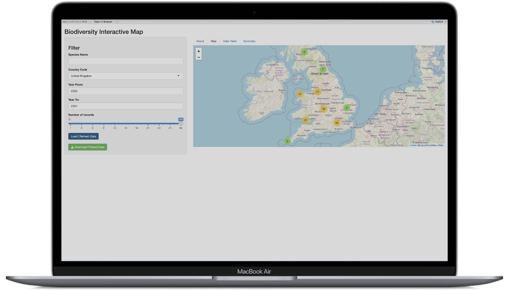

## Introduction

This report presents an analysis of bird occurrence data in the United Kingdom, focusing on two common species: the Blue Tit (*Cyanistes caeruleus*) and the European Robin (*Erithacus rubecula*).

We developed an interactive Shiny application that retrieves real-time biodiversity data from the Global Biodiversity Information Facility (GBIF) Occurrences API, allowing users to explore geographic distributions of species across the UK.

Using data downloaded from this application, we conducted a series of statistical analyses to examine the spatial patterns of these bird species. Specifically, we employed the jackknife resampling method to estimate the precision of mean latitude observations, used bootstrap regression to investigate how geographic coordinates predict species locations, and performed hypothesis tests to determine whether the two species differ significantly in their east-west distributions.

The analyses demonstrate both classical parametric approaches and modern computational resampling techniques, with results presented for both technical and non-technical audiences. Our Shiny application is publicly available at [Puffin Shiny App](https://atucker.shinyapps.io/just_final_shiny_app/), and all code and data are available in our GitHub repositories: [Report repository link](https://github.com/mt5763standrews/group-report-puffin) and [Shiny app repository link](https://github.com/mt5763standrews/shiny-app-puffin/tree/main).

## 1. Shiny App

### Shiny App Description

Our Shiny App uses the GBIF “Occurrences” API to display occurrences of different species. GBIF stands for “Global Biodiversity Information Facility” and includes various large datasets relating to plant and animal records. Specifically, we used their “Occurrences” API, which gives sightings data for various species across the world. Unfortunately, because of the Occurrences API settings, users are only able to download up to 300 records. 

To search for occurrence data, users specify the scientific name of the species they are looking for. They can also specify the country code, region, and years that they want to retrieve data for. The app includes an interactive map that plots where exactly each occurrence was recorded. 

<a>  </a>

The app includes four tabs that users can chose from. The first tab shows a short about/instruction text for the user. The second tab shows the interactive map, the third tab gives a data table for occurrences matching the filters and the fourth tab gives as summary of the data requested. 

<a>  </a>

To download the dataset, users need to click blue "load data” after specifying their filters. Once this data has loaded on the map, users can click the green “download filtered data” button.  

## 2. Jackknife Analysis

### Introduction

This analysis examines the geographic distribution of bird sightings using biodiversity data extracted from puffins shiny app. We focus on two common European bird species: the Blue Tit (*Cyanistes caeruleus*) and the European Robin (*Erithacus rubecula*). Our objective is to estimate the mean latitude of bird observations and assess the precision of this estimate using the jackknife resampling method.

```{python}
# Import packages for the rest of the tasks 2-4
import time
import requests

import numpy as np
import pandas as pd

import matplotlib.pyplot as plt
import seaborn as sns
import plotnine as p9

from scipy import stats
from scipy.stats import ttest_ind

import statsmodels.api as sm
import statsmodels.formula.api as smf
from statsmodels.stats.weightstats import DescrStatsW, CompareMeans

from sklearn.utils import resample
```

```{python}
# for better visualizations
sns.set_style('whitegrid')
plt.rcParams['figure.figsize'] = (10, 6)
plt.rcParams['font.size'] = 10
```

```{python}
# Load data from CSV files
df1 = pd.read_csv("Data/GBIF_Cyanistes_caeruleus_2025.csv")
df2 = pd.read_csv("Data/GBIF_Erithacus_rubecula_2025.csv") 

# Combine datasets
df_combined = pd.concat([df1, df2], ignore_index=True)

print(f"Total observations loaded: {len(df_combined)}")
print(f"Blue Tit observations: {len(df1)}")
print(f"European Robin observations: {len(df2)}")
```

### Data Preparation and Exploration

We extract the latitude values from our combined dataset and examine the basic statistics.

```{python}
#Extract decimallatitude variable for analysis 
latitude_data = df_combined['decimalLatitude'].dropna()

print("="*60)
print("DESCRIPTIVE STATISTICS")
print("="*60)
print(f"Sample size (n): {len(latitude_data)}")
print(f"Range: {latitude_data.min():.2f}° to {latitude_data.max():.2f}°")
print(f"Mean latitude: {latitude_data.mean():.4f}°")
print(f"Median latitude: {latitude_data.median():.4f}°")
print(f"Standard deviation: {latitude_data.std():.4f}°")
print("="*60)
```

Our dataset combines 600 bird observations from two species (300 Blue Tits and 300 European Robins) collected across the United Kingdom. The latitude values, representing the geographic north-south position of each sighting, serve as our numerical variable of interest. These observations span from southern England to northern Scotland, providing a comprehensive view of where these species are commonly found.

### Visualization of Distribution

To understand the geographic distribution of our bird observations, we examine both the central tendency (mean) and the spread of latitude values. The visualization below displays the distribution of observations, with the mean latitude clearly marked to show where bird sightings are centered.\

```{python}
# Create histogram with density curve &  mean line
plt.figure(figsize=(10, 6))

# KDE overlay
sns.histplot(latitude_data, bins=30, stat='density', alpha=0.7, 
             color='steelblue', edgecolor='black', kde=True, label='Observations')

#Mean line
plt.axvline(latitude_data.mean(), color='red', linestyle='--', 
            linewidth=2.5, label=f'Mean: {latitude_data.mean():.2f}°')

plt.xlabel('Latitude (degrees North)', fontsize=12)
plt.ylabel('Density', fontsize=12)
plt.title('Distribution of Bird Observation Latitudes', fontsize=14, fontweight='bold')
plt.legend(fontsize=11)
plt.grid(True, alpha=0.3)
plt.tight_layout()
plt.show()
```

The histogram reveals a relatively symmetric distribution of latitudes centered around 52.70° North—approximately the latitude of central England. The concentration of observations near this mean, combined with the spread extending from 50° to 57° North, indicates that while these bird species are found throughout the UK, sightings are most common in the central regions. The absence of extreme outliers suggests the data is well-behaved and suitable for both jackknife and analytical methods.

### Jackknife Implementation

The jackknife method creates *n* samples from the original data of size *n*, where each sample has exactly one observation removed. This systematic approach provides an estimate of the variability of our statistic of interest.

The jackknife estimate of the standard error (SE) is calculated as $$SE = \sqrt{\frac{n-1}{n} \sum_{i=1}^{n}(\theta_i - \bar{x})^2}, $$

where:

-   *n* is the sample size
-   $\theta_i$ is the mean of the original sample
-   $\bar{x}$ is the mean of the *i*-th jackknife sample (with observation *i* removed)

```{python}
# Functions used for the Jackknife analysis
def jackknife_samples(data):
    n = len(data)
    data_array = np.array(data)
    samples = []
    
    for i in range(n):
        sample = np.concatenate([data_array[:i], data_array[i+1:]])
        samples.append(sample)
    
    return samples


def jackknife_standard_error(data, statistic=np.mean):
    n = len(data)
    data_array = np.array(data)
    
    # Calc the statistic for the original sample
    original_statistic = statistic(data_array)
    
    # Generate jackknife samples and calculate statistic for each
    jk_statistics = []
    for i in range(n):
        jk_sample = np.concatenate([data_array[:i], data_array[i+1:]])
        jk_stat = statistic(jk_sample)
        jk_statistics.append(jk_stat)
    
    jk_statistics = np.array(jk_statistics)
    
    # Calc jk standard error using the formula
    jk_se = np.sqrt(((n - 1) / n) * np.sum((jk_statistics - original_statistic) ** 2))
    
    return jk_se, jk_statistics, original_statistic
```

```{python}
#jackknife analysis
jk_se, jk_stats, original_mean = jackknife_standard_error(latitude_data)

print("="*60)
print("JACKKNIFE RESULTS")
print("="*60)
print(f"Original sample mean: {original_mean:.6f}°")
print(f"Mean of jackknife statistics: {np.mean(jk_stats):.6f}°")
print(f"Jackknife Standard Error: {jk_se:.6f}°")
print(f"Number of jackknife samples: {len(jk_stats)}")
print("="*60)
```

The jackknife analysis systematically created 600 samples, each excluding a single observation. The resulting standard error of 0.065499° quantifies the precision of our mean estimate. This small value relative to the mean (52.70°) indicates high precision. Our estimate is accurate to within approximately 7 kilometers, which is remarkably precise given we're analyzing observations across the entire UK.

### Comparison with Analytical Standard Error

We now compare the jackknife estimate with the analytical (theoretical) standard error, which for the mean is calculated as $$SE_{analytical} = \frac{s}{\sqrt{n}},$$ where *s* is the sample standard deviation and *n* is the sample size.

This comparison serves two purposes:

1.  It confirms the accuracy of our jackknife implementation.
2.  It also verifies that our data meets the assumptions underlying the analytical approach.

```{python}
# Calculate analytical standard error
# SE_analytical = s / sqrt(n)
n = len(latitude_data)
sample_std = latitude_data.std(ddof=1)  # ddof=1 for sample std deviation
analytical_se = sample_std / np.sqrt(n)

print("="*60)
print("COMPARISON: JACKKNIFE CS ANALYTICAL")
print("="*60)
print(f"Sample size (n):              {n}")
print(f"Sample standard deviation:    {sample_std:.6f}°")
print(f"")
print(f"Analytical Standard Error:    {analytical_se:.6f}°")
print(f"Jackknife Standard Error:     {jk_se:.6f}°")

print("="*60)
```

This identical match indicates that:

1.  Our data is well-behaved:The absence of extreme outliers and the approximately normal distribution mean the analytical formula is appropriate.
2.  The jackknife successfully captured variability: The resampling procedure correctly estimated the sampling distribution of the mean.
3.  Both methods are reliable: The agreement validates our computational implementation and confirms we can trust either method for inference.

Using our standard error, we construct a 95% confidence interval: \[52.70° ± 0.13°\] or \[52.57°, 52.83°\]. This narrow interval reflects the high precision of our estimate, enabled by our large sample size of 600 observations.\

```{python}
# Calculate 95% confidence interval
ci_95 = 1.96 * jk_se
print(f"\n95% Confidence Interval: {original_mean:.2f}° ± {ci_95:.4f}°")
print(f"Range: [{original_mean - ci_95:.2f}°, {original_mean + ci_95:.2f}°]")
```

### Visualization of JK Statistics

The distribution of jackknife statistics provides visual confirmation of our numerical results. Each of the 600 points represents a mean calculated from a dataset with one observation removed. The tight clustering demonstrates the stability of our estimate.

```{python}
plt.figure(figsize=(10, 6))

plt.hist(jk_stats, bins=50, density=True, alpha=0.7, 
         color='steelblue', edgecolor='black', label='Jackknife statistics')
plt.axvline(original_mean, color='red', linestyle='--', 
            linewidth=2, label=f'Original mean: {original_mean:.3f}°')
plt.axvline(np.mean(jk_stats), color='green', linestyle=':', 
            linewidth=2, label=f'Mean of JK stats: {np.mean(jk_stats):.3f}°')

plt.xlabel('Latitude (degrees North)', fontsize=11)
plt.ylabel('Density', fontsize=11)
plt.title('Distribution of Jackknife Statistics', fontsize=12, fontweight='bold')
plt.legend(fontsize=9)
plt.grid(True, alpha=0.3)
plt.tight_layout()
plt.show()
```

The perfect overlap between the original mean (red line) and the mean of jackknife statistics (green line) confirms that the jackknife procedure introduces no systematic bias. The narrow spread of the distribution, spanning less than 0.5° total, visually illustrates why our standard error is so small and why we can be confident in our estimate.

### What does this mean? (Summary for non technical reader)

If someone asks "where in the UK are Blue Tits and European Robins typically observed?", we can confidently answer: around 52.70° North, with high precision.

This precision is valuable for conservation planning, understanding how bird distributions might change with climate, and mapping biodiversity across the UK. The very small standard error means that even with birds observed across a 700+ kilometer range, we can determine the average location with great accuracy thanks to our large sample size.

## 3. Bootstrap Regression

### Introduction

In this section, we investigate the factors influencing the spatial distribution of our two species: the Blue Tit (*Cyanistes caeruleus*) and the European Robin (*Erithacus rubecula*). Therefore, we implement several analysis: - Correlation Matrix: To check for multicollinearity between variables. - Linear Regression: To examine whether the latitude is predicted by longitude within the sampled area to see if there is a significant geographic trend in the species sampled area. - Model Selection (AIC): To statistically determine whether including `coordinateUncertaintyInMeters` improves the model's predictive power. - Bootstrap Resampling: To validate the stability of our regression coefficients and generate robust confidence intervals, ensuring our findings are not driven by outliers.

First, we will create a visualisation comparing the relationship between `decimalLatitude` a single numerical response/outcome variable and `decimalLongitude` a single numerical explanatory variable.

```{python}
plt.scatter(df_combined["decimalLongitude"], df_combined["decimalLatitude"])
plt.title("The relationship between Longitude and Latitude")
plt.xlabel("Longitude")
plt.ylabel("Latitude")
```

### Correlation Analysis

Before fitting a linear regression model, we perform a correlation test to check for multicollinearity between the predictors: `decimalLatitude`,`decimalLongitude`,`coordinateUncertaintyInMeters`

```{python}
model_cols = ["decimalLatitude", "decimalLongitude", "coordinateUncertaintyInMeters"]

df_model = df_combined[model_cols].dropna()

# Generate correlation matrix
corr_matrix = df_model.corr()

# Plot correlation matrix
sns.heatmap(corr_matrix, annot = True)
plt.title("Correlation Matrix")

```

The correlation between these 2 explanatory variables `decimalLongitude` and `coordinateUncertaintyInMeters` is very close to zero (correlation = 0.013), which means multicolinearity is not a concern. This allows both variables to be included in the regression model, provided they are relevant for explaining the response variable.

There is a moderate negative correlation (correlation = -0.37) between `decimalLatitude` vs `decimalLongitude`, which means locations with higher latitude tend to have lower longitude in this dataset, and vice versa. This can also be seen in the scatterplot displayed the relationship between Longitude and Latitude, the species is distributed along a diagonal gradient from the high latitude-low longtitude locations to the low latitude-high longitude locations.

The correlation is weak (correlation = -0.12) between `decimalLatitude` vs `coordinateUncertaintyInMeters`. This suggests that location with a lower latitude tends to have more coordinate uncertainty. However, as the relationship is weak,`coordinateUncertaintyInMeters` is likely not a useful variable for predicting where the bird lives. We will see more later if we should drop `coordinateUncertaintyInMeters` variable, but for now we will keep it.

### Linear Regression

We are going to test the linear regression model below with `decimalLatitude` is a response variable and `decimalLongitude` and `coordinateUncertaintyInMeters` are explanatory variables:

$$ decimalLatitude = \beta_0 + \beta_1(decimalLongitude) + \beta_2(coordinateUncertaintyInMeters) + \epsilon $$

```{python}
# Fit the model
model_orgn = smf.ols(formula = "decimalLatitude ~ decimalLongitude + coordinateUncertaintyInMeters", data = df_model).fit()

# Print the first table in OLS results only to keep the table short
print(model_orgn.summary2().tables[1])

# Print the R squared
print(f"R-squared: {model_orgn.rsquared:.2f}")

#print(model_orgn.summary())
```

The results show that the model is statistically significant (p-value = 3.75e-19). However, the model only explains 14.8% of the variation in latitude: \* `decimalLongitude`(Coefficient: -0.3717 ;P-value: 0.000): for every 1 degree increase in longitude, the latitude decreases by \~0.37 degrees. \* `coordinateUncertaintyInMeters` (Coefficient: -2.295e-05; P-value: 0.005): records with higher uncertainty tend to be found at lower latitude.

### Model Selection (AIC)

We also perform the Akaike Information Criterion (AIC) to help us to select the best model. By doing this, we only keep variables that significantly improve the model predictive power. Therefore, we defined a reduced model without `coordinateUncertaintyInMeters` covariate because we want to know if removing one covariate to keep our model simpler is better or not.

$$ decimalLatitude = \beta_0 + \beta_1(decimalLongitude) + \epsilon $$

```{python}
model_reduced = smf.ols("decimalLatitude ~ decimalLongitude", data = df_model).fit()

print(f"AIC of the original model: {model_orgn.aic:.2f}") 
print(f"AIC of reduced model: {model_reduced.aic:.2f}")

```

We see that the AIC of the reduced model (1928.34) is roughly 6 points higher than the original model (1922.39). This means the original regression model, that includes `coordinateUncertaintyInMeters` covariate, adds real predictive power over the reduced regression model.

### Bootstrap Resampling

To ensure our model is not overfitting to specific outliers, we perform a bootstrap analysis. We resample the dataset with replacement 1000 times and recalculate the coefficients.

```{python}
n_repeat = 1000
np.random.seed(123) 
boot_params = []

for i in range(n_repeat):
    # Resample the data
    boot_df = resample(df_model, replace=True, n_samples = len(df_model))
    
    # Fit the model to the resampled data
    boot_fit = smf.ols(formula = "decimalLatitude ~ decimalLongitude + coordinateUncertaintyInMeters", data = boot_df).fit()
    
    # Store the parameters
    boot_params.append(boot_fit.params)

# Convert list to dataframe
boot_df_params = pd.DataFrame(boot_params)

# Calculate 95% CI
ci_lower = boot_df_params.quantile(0.025)
ci_upper = boot_df_params.quantile(0.975)

# Put the results into a df 
results_df = pd.DataFrame({"Lower CI": ci_lower, "Upper CI": ci_upper, "Observed Coef": model_orgn.params})

print(results_df)
```

The bootstrap results once again confirm that both `decimalLongitude` and `coordinateUncertaintyInMeters` are significant predictors in the larger dataset, as neither confidence interval crosses zero: - `decimalLongitude`: We are 95% confident that the true slope lies between -0.46 and -0.29, which means for every 1 degree increased in the longitude, the latitude of species' location decreased approximately by 0.29 to 0.46 degrees. - `coordinateUncertaintyInMeters`: This once again confirms that records with higher uncertainty are likely to be associated with lower latitudes in this dataset.

### Explanation for non-technical audience

In plain text, we want to understand here how these bird species are distributed across the landscape. Therefore, we check if their location changes in a predictable pattern and if the quality of the GPS data depends on where the birds were found, and we found that:

1.  The species is not randomly scattered, but it follows a diagonal trend from Northwest down to Southeast. So if we look further East where has higher longitude, the birds are likely to be found further South where has a lower latitude.
2.  Data quality is different by locations. So we found that records collected in the South where has a lower latitude are likely to more uncertainty, meaning the GPS coordinates were less precise, compared to records from the North where has higher latitude.

-\> In the end, we does the simulation to repeat the study 1,000 times to double check these results. The outcomes are consistent every time, meaning these 2 trends are real not just random accidents in the numbers.

## 4. T tests

### Introduction

In this task we assess the difference in mean longitude between bluetits and robins using simulation based and parametric methods. We first do a randomization test to get an approximate p value for the difference in means. We then use bootstrap resampling to estimate a 95 percent confidence interval and compare this with the interval from the Welch t test. Lastly, we interpret these results to evaluate how strong the evidence is for a *significant* difference in mean longitude between the two species.

```{python}
df_bluetit = df1
df_robin   = df2

#lat_bluetit = df_bluetit["decimalLatitude"].dropna().astype(float).values
lon_bluetit = df_bluetit["decimalLongitude"].dropna().astype(float).values

#lat_robin   = df_robin["decimalLatitude"].dropna().astype(float).values
lon_robin   = df_robin["decimalLongitude"].dropna().astype(float).values
```

### Visual comparison of the two groups

As we have done before, we will explore whether the two bird species differ in their positions. The following plots help us see both the data patterns and the behavior of our test data.

```{python}
# Longitude
plt.figure()
plt.hist(lon_robin,   bins=30, alpha=0.5, label="Robin")
plt.hist(lon_bluetit, bins=30, alpha=0.5, label="Blue tit")
plt.xlabel("Longitude")
plt.ylabel("Count")
plt.title("Longitude distributions for the two species")
plt.legend()
plt.show()
```

```{python}
#t_lat, p_lat = ttest_ind(lat_bluetit, lat_robin, alternative="two-sided")
#print("Latitude t test (Bluetit vs Robin)")
#print(f"  t = {t_lat:.3f}, p = {p_lat:.5g}")
#print(f"  mean lat bluetit = {lat_bluetit.mean():.4f}")
#print(f"  mean lat robin   = {lat_robin.mean():.4f}")
#print()
```

```{python}
# Longitude
t_lon, p_lon = ttest_ind(lon_bluetit, lon_robin, alternative="two-sided")
print("Longitude t test (Bluetit vs Robin)")
print(f"  t = {t_lon:.3f}, p = {p_lon:.5g}")
print(f"  mean lon bluetit = {lon_bluetit.mean():.4f}")
print(f"  mean lon robin   = {lon_robin.mean():.4f}")
print()
```

The above plot summarizes the longitude data for bluetits and robins using aggregated summaries. The locations of the two species are close, with the robin distribution shifted slightly towards lower longitudes. The first impression is that the difference in longitude between the species is fairly small.

### Randomization test

Next we will analyze the difference in mean longitude using a randomization test, using the given code in chapter 25.2 (\*24.2) of the lecture notes. The idea is to construct the sampling distribution of a chosen test statistic by repeatedly shuffling the group labels.

We take as our test statistic the difference in sample means $$ T = \bar{x}_{\text{robin}} - \bar{x}_{\text{bluetit}}, $$ where $\bar{x}_{\text{robin}}$ and $\bar{x}_{\text{bluetit}}$ denote the mean longitudes in each group. Under the null hypothesis **H0** that there is no difference in the mean longitude of the two species, the observed longitude values are assumed to come from the same underlying distribution and the labels `robin` and `bluetit` are therefore interchangeable.

To approximate the null distribution of $T$, we repeatedly shuffle the species labels, recompute the difference in means each time and store the resulting values. The collection of permutations gives us an empirical sample distribution under **H0**. By comparing the observed statistic $T_{\text{obs}}$ to this null distribution, we get an approximate two sided randomization p value for testing whether there is a *significant* difference in mean longitude between bluetits and robins.

When applying both the slow and fast randomization tests we get the same observed difference in means $T_{\text{obs}} \approx$ -0.229012 degrees (Robin − Blue tit), represented below by a red line.

#### Slow Version

```{python}
# Initialisation
start_time1 = time.time()
n_repeat = 1000                     # number of shuffles
groups_data = np.concatenate((
    np.repeat("X", len(lon_robin)),    # X = Robin
    np.repeat("Y", len(lon_bluetit))   # Y = Blue tit
))

values_data = np.hstack((lon_robin, lon_bluetit))

test_stats = np.empty(n_repeat)
np.random.seed(5763)                # for reproducibility

# Loop n_repeat times
for rep in range(n_repeat):
    # Shuffle the order of the group labels
    shuffled_group = np.random.permutation(groups_data)
    
    # Compute and store test statistic (difference in means)
    meanX = np.mean(values_data[shuffled_group == "X"])
    meanY = np.mean(values_data[shuffled_group == "Y"])
    test_stats[rep] = meanX - meanY

# Observed test statistic
observed_stat = lon_robin.mean() - lon_bluetit.mean()

end_time1 = time.time()
total_time1 = end_time1 - start_time1

# print("observed_statistic:", observed_stat)
```

```{python}
# Include the observed statistic as convention
test_stats_with_obs = np.hstack((test_stats, observed_stat))

p_rand = np.sum(np.abs(test_stats_with_obs) >= np.abs(observed_stat)) / len(test_stats_with_obs)
print("Total time taken slow version:", total_time1)
print("Randomization p value (two sided):", p_rand)
```

```{python}
df_rand = pd.DataFrame({"test_stats": test_stats})

(
    p9.ggplot(df_rand, p9.aes(x="test_stats"))
    + p9.geom_histogram(fill="skyblue", bins=30)
    + p9.geom_vline(xintercept=observed_stat, color="red")
    + p9.labs(
        title="Randomization test distribution (slow version)",
        x="Difference in mean longitude",
        y="Count"
    )
)
```

For the slow version of the randomization test, we used the code given in chapter 24.2. We got an approximate null distribution under H0: **no difference in mean longitude.** The observed statistic lies in the tail of this distribution, giving a two sided p value of $p_{\text{rand, slow}}$ = 0.0759.

The classical Welch two sample t test (see the longitude t test results above) gave us a very similar p value of 0.0731. This shows that the randomization test and the t test lead to the same conclusion: **at the 5 percent level we do not reject H0**. In conclusion, the p values are similar apart from small background *noise*, so the randomization test and the parametric t test agree.

#### Faster version

The fast version uses exactly the same idea as the slow version, but it avoids doing unnecessary work inside the loop.

In the slow version, each time we shuffle the labels we also repeat several extra steps, such as creating new data structures and recalculating quantities that do not actually change from one loop to the next. This makes each permutation a bit more heavy and therefore slower.

In the fast version, we keep as much as possible fixed outside the loop and reuse it for every permutation. For example, we work directly with NumPy arrays, avoid creating new objects repeatedly and only update the parts that depend on the shuffling of the labels. This is why the fast version can run about three times quicker, even though it produces the same kind of randomised statistics and leads to the same conclusion.

```{python}
# Fast randomization test (index shuffling)
start_time2 = time.time()
n_repeat = 1000
values_data = np.hstack((lon_robin, lon_bluetit))
n_x = len(lon_robin)         # size of group X
n_total = len(values_data)

idx = np.arange(n_total)
test_stats_fast = np.empty(n_repeat)
rng = np.random.default_rng(5763)

for rep in range(n_repeat):
    rng.shuffle(idx)                  # shuffle indices in place
    x_idx = idx[:n_x]                 # first n_x indices => X
    y_idx = idx[n_x:]                 # remaining => Y
    meanX = values_data[x_idx].mean()
    meanY = values_data[y_idx].mean()
    test_stats_fast[rep] = meanX - meanY
    
  
# Observed test statistic (Robin minus Blue tit)
observed_stat = lon_robin.mean() - lon_bluetit.mean()

end_time2 = time.time()
total_time2 = end_time2 - start_time2
print("Total time taken fast version:", total_time2)

#print("observed_statistic:", observed_stat)

# Use the fast randomization distribution
test_stats = test_stats_fast

# Two sided p value, following the notes (include observed statistic)
test_stats_with_obs = np.hstack((test_stats, observed_stat))
p_rand = np.sum(np.abs(test_stats_with_obs) >= np.abs(observed_stat)) / len(test_stats_with_obs)

print("Randomization p value (two sided):", p_rand)
```

```{python}
df_rand = pd.DataFrame({"test_stats": test_stats})
(
    p9.ggplot(df_rand, p9.aes(x="test_stats"))
    + p9.geom_histogram(fill="skyblue", bins=30)
    + p9.geom_vline(xintercept=observed_stat, color="red")
    + p9.labs(
        title="Randomization test distribution (fast version)",
        x="Difference in mean longitude",
        y="Count"
    )
)
```

As stated before, the fast version uses the same statistic and the same number of permutations but removes unnecessary work inside the loop. The total time for 1000 permutations decreased from $t_{\text{slow}} \approx$ 0.020 seconds to $t_{\text{fast}} \approx$ 0.007 seconds, which is a speed up by a factor of about $$ \frac{t_{\text{slow}}}{t_{\text{fast}}} \approx \frac{0.020}{0.007} \approx 3.0 $$

The p value from the fast implementation was $p_{\text{rand, fast}}$ = 0.0799, which is very close to the slow version. The small difference between $p_{\text{rand, slow}}$ = 0.0759 and $p_{\text{rand, fast}}$ = 0.0799 is within the variability expected from using 1000 permutations. Therefore the slow and fast versions lead to the same practical conclusion, but the fast version achieves this result in roughly one third of the time.

### Bootstrap estimate of difference of means

To quantify the uncertainty around the difference in mean longitude between robins and bluetits, we use a bootstrap procedure based on 1000 resamples of the data. For each bootstrap sample we compute the T statistic from before.

The resulting bootstrap distribution of $T$ is approximately centred slightly below zero, reflecting that the observed mean longitude for robins is lower than for bluetits.

From the empirical bootstrap distribution we obtain the 2.5th and 97.5th percentiles, which give a 95% bootstrap confidence interval for the difference in mean longitude of $$ \text{CI}_{\text{bootstrap}} = [-0.47707, 0.00926]. $$

This interval is visualised in the bootstrap plot below, where the histogram of bootstrap replicates shows the sampling variability of $T$ and two vertical lines indicate the lower and upper confidence limits.

```{python}
n_boot = 1000
np.random.seed(5763)

# Create bootstrap samples for each group
outboot_x = np.random.choice(lon_robin,   size=(n_boot, len(lon_robin)))
outboot_y = np.random.choice(lon_bluetit, size=(n_boot, len(lon_bluetit)))

# Means of each bootstrap sample
bootmeans_x = outboot_x.mean(axis=1)
bootmeans_y = outboot_y.mean(axis=1)

# Bootstrap distribution of the difference in means (X - Y)
bootdiff = bootmeans_x - bootmeans_y
confint = np.quantile(bootdiff, [0.025, 0.975])

print("Bootstrap 95 percent CI for difference in mean longitude (Robin - Blue tit):")
print(confint)
```

```{python}
df_boot = pd.DataFrame({"bootmeans": bootdiff})
df_ci   = pd.DataFrame({"confint": confint})

(
    p9.ggplot(df_boot, p9.aes(x="bootmeans"))
    + p9.geom_histogram()
    + p9.geom_vline(df_ci, p9.aes(xintercept="confint"), color="red")
    + p9.labs(
        title="Bootstrap distribution of difference in mean longitude",
        x="Difference in mean longitude (Robin - Blue tit)",
        y="Count"
    )
)
```

### Statsmodel estimate of difference of means

We also compute a 95% confidence interval for the same parameter using the analytical Welch t test as implemented in \texttt{statsmodels}. This method gives $$ \text{CI}_{\text{t based}} = [-0.47953, 0.02151]. $$

The two intervals are very similar. Both are centred around a small negative value, consistent with the observed difference in means $T_{\text{obs}}$ = -0.22901 and both intervals include zero. The lower bounds are almost identical (-0.48 to two decimal places), while the upper bound from the t based interval extends slightly further into positive values (0.0215 compared to 0.0093 for the bootstrap interval). In other words, the t based interval is marginally wider on the upper side.

Since both intervals include zero, they lead to the same conclusion: at the 5% significance level we do **not** have strong enough evidence to claim that the true difference in mean longitude between robins and bluetits is non-zero. The similarities between the bootstrap and t based intervals also suggests that the assumptions underlying the t test are compatible with the data in this case.

```{python}
from statsmodels.stats.weightstats import DescrStatsW, CompareMeans

d1 = DescrStatsW(lon_robin)
d2 = DescrStatsW(lon_bluetit)
cm = CompareMeans(d1, d2)

ci_t = cm.tconfint_diff(alpha=0.05, usevar="unequal")
print("Statsmodels 95 percent CI for difference in mean longitude (Robin - Blue tit):")
print(ci_t)
```

### Explanation for non-technical audience

In easy terms, we are trying to find out whether robins and bluetits tend to live in different places from west to east (longitudinal coordinates). In our data, robins appear on average about 0.23 degrees (equating to approximately 15 km) further west than bluetits. The question is whether this difference is large enough that we can be confident it has a real effect, rather than just random variation in where the birds happened to be observed.

To answer this, we use two methods that both produce a range of possible values for the true difference between the two species. One method (the bootstrap) repeatedly reuses the data in a repetitive way to collect new samples. The other method relies on a standard statistical formula. Both approaches give almost the same result (looking at the confidence intervals above):

-   The true difference could be slightly negative (meaning robins may be a bit further west).
-   Or it could be very close to zero (meaning the species could be equally distributed).

Because zero lies inside both intervals, the data does not provide strong evidence that robins and bluetits genuinely prefer different longitudes.

In conclusion, although robins in this dataset seem a little further west on average, the difference is small enough that it could just be random. Based on these observations, we cannot confidently say the two species occupy different longitudinal regions of the UK.
